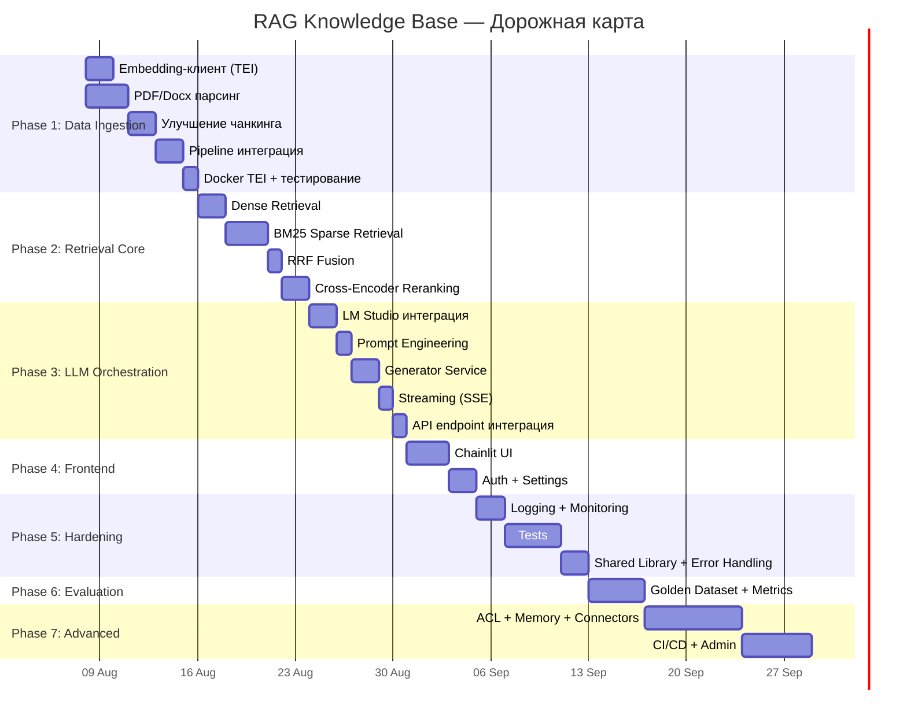

# План разработки: Корпоративная RAG-база знаний

> **Проект:** Enterprise Knowledge Base & Semantic Search Engine (RAG)
> **Дата создания:** 2026-08-07
> **Основа:** Техническая документация RAG-база знаний.md

---

## Аудит текущего состояния

### Текущее состояние кодовой базы

> **Примечание:** По результатам аудита, все исполняемые файлы (.py), инфраструктурные (Dockerfile, docker-compose.yml, requirements.txt, .env.example) — **пустые (0 байт)**. Реализована только проектная документация (README.md в каждом модуле) и .gitignore.

| Модуль | Файл | Статус | Описание |
|--------|-------|--------|----------|
| **docs** | `Техническая документация RAG-база знаний.md` | ✅ Реализовано | Полная архитектурная документация (17KB) |
| **app** | `README.md` | ✅ Документация | Архитектура модуля, Pydantic-схемы, контракты API |
| **app** | `main.py` | ❌ Пустой (0B) | Нет кода FastAPI-приложения |
| **app/api** | `README.md` | ✅ Документация | Спецификация routing layer, правила zero-business-logic |
| **app/api** | `__init__.py` | ❌ Пустой (0B) | — |
| **app/core** | `README.md` | ✅ Документация | Спецификация config, llm, prompts, logger |
| **app/core** | `__init__.py` | ❌ Пустой (0B) | — |
| **app/services** | `README.md` | ✅ Документация | Спецификация retriever, reranker, qa_chain |
| **app/services** | `__init__.py` | ❌ Пустой (0B) | — |
| **app/models** | `README.md` | ✅ Документация | Спецификация Pydantic DTO (api.py, domain.py) |
| **app/models** | `__init__.py` | ❌ Пустой (0B) | — |
| **sync** | `README.md` | ✅ Документация | Архитектура sync-agent, payload schema Qdrant |
| **sync** | `main.py` | ❌ Пустой (0B) | Нет кода watchdog-мониторинга |
| **sync** | `parser.py` | ❌ Пустой (0B) | Нет парсеров MD/PDF/Docx |
| **sync** | `chunker.py` | ❌ Пустой (0B) | Нет алгоритма чанкинга |
| **sync** | `qdrant_store.py` | ❌ Пустой (0B) | Нет клиента Qdrant |
| **sync** | `Dockerfile` | ❌ Пустой (0B) | — |
| **sync** | `requirements.txt` | ❌ Пустой (0B) | — |
| **frontend** | `README.md` | ✅ Документация | Спецификация UI, user context, auth, payload |
| **frontend** | `app.py` | ❌ Пустой (0B) | Нет кода Chainlit-интерфейса |
| **frontend** | `Dockerfile` | ❌ Пустой (0B) | — |
| **frontend** | `requirements.txt` | ❌ Пустой (0B) | — |
| **infra** | `docker-compose.yml` | ❌ Пустой (0B) | Нет конфигурации контейнеров |
| **infra** | `requirements.txt` | ❌ Пустой (0B) | Нет зависимостей |
| **infra** | `.env.example` | ❌ Пустой (0B) | Нет шаблона переменных окружения |
| **infra** | `.gitignore` | ✅ Реализовано | Настроен для Python RAG-проекта (475B) |
| **infra** | `CHANGELOG.md` | ✅ Реализовано | Начальные записи о создании структуры |

### Что НЕ реализовано ❌

- Гибридный поиск (Dense + BM25 + RRF)
- Cross-encoder Reranking
- Интеграция с LLM (LM Studio / Qwen3 через OpenAI-совместимый API)
- Генерация эмбеддингов через TEI (Text Embeddings Inference)
- Парсинг PDF и Docx
- Streaming ответов (SSE)
- Аутентификация пользователей в Chainlit
- Метрики качества RAG (Faithfulness, Relevance, Context Recall)
- Логирование и мониторинг
- Тесты (unit, integration, e2e)
- CI/CD pipeline

---

## Фазы разработки

---

## Phase 1 — Фундамент: Data Ingestion Pipeline & DB
> **Цель:** Полностью рабочий пайплайн загрузки документов через API и настройка БД.
> **Ожидаемый результат:** Настроен PostgreSQL для юзеров/ролей, готов эндпоинт для загрузки файлов, который асинхронно разбивает файлы на чанки, векторизует и сохраняет в Qdrant.

### 1.1. База данных PostgreSQL (RBAC & Documents) [✅ Done]
**Директория:** `app/db/` (новая)

| Задача | Детали |
|--------|--------|
| Модели SQLAlchemy | Таблицы `User` (username, password_hash, role), `Document` (doc_id, filename, status, allowed_roles) |
| Инициализация БД | Автоматическое создание таблиц при старте. Создание default admin юзера. |
| Хранение в Volume | Настройка Docker контейнера PostgreSQL и volume для данных |

### 1.2. Интеграция с Embedding-сервисом [✅ Done]
**Файл:** `app/ingestion/embeddings.py` (перенос логики из sync)

| Задача | Детали |
|--------|--------|
| Создать клиент для TEI API | HTTP-клиент (`httpx.AsyncClient`) для вызова `POST /embed` на сервере Text Embeddings Inference |
| Поддержка батчевой генерации | Группировка чанков по батчам (batch_size=32) для эффективной генерации эмбеддингов |
| Retry-логика | Exponential backoff при 5xx ошибках, timeout 30s |
| Валидация размерности | Проверка что вектор = 1024 (multilingual-e5-large) |
| Prefix для e5 моделей | Добавление `"query: "` / `"passage: "` prefix к текстам для корректной работы e5-large |

**Входные данные:** Список строк (чанков текста)
**Выходные данные:** Список float-векторов размерности 1024

### 1.4. Парсинг и Чанкинг документов [✅ Done]
**Директория:** `app/ingestion/`parser.py`

| Задача | Детали |
|--------|--------|
| PDF-парсинг | Реализовать через `pymupdf4llm` или `pdfplumber`. Извлечение текста с сохранением структуры заголовков |
| Docx-парсинг | Реализовать через `python-docx`. Обход параграфов, заголовков и таблиц |
| Нормализация текста | Очистка от двойных пробелов, пустых строк, служебных символов, нормализация Unicode |
| Извлечение метаданных | Из Markdown: YAML frontmatter. Из PDF: metadata полей. Из Docx: core properties |
| Определение `document_type` | Эвристика по расширению, содержимому или frontmatter |

### 1.4. Улучшение чанкинга
**Файл:** `app/ingestion/chunker.py`

| Задача | Детали |
|--------|--------|
| Семантический чанкинг | Разбиение по заголовкам (H1, H2, H3) как первичные сепараторы |
| Контроль длины | Чанки 512–1024 токенов. Использовать `tiktoken` для точного подсчёта |
| Overlap | 10–15% перекрытие между чанками для контекстных связей |
| Метаданные чанка | Каждый чанк получает: `chunk_index`, `heading_hierarchy` (путь заголовков), `total_chunks` |

### 1.5. API загрузки и BackgroundTasks [✅ Done]
**Файл:** `app/api/endpoints.py`, `app/ingestion/pipeline.py`

| Задача | Детали |
|--------|--------|
| Эндпоинт `POST /upload` | Принимает `UploadFile` и `allowed_roles`. Сохраняет файл в Docker volume (`/app/data/uploads/`). |
| BackgroundTask | Запускает пайплайн асинхронно: парсер → чанкер → эмбеддинги → Qdrant. |
| Обновление статуса в БД | Запись статуса документа в PostgreSQL (`processing`, `completed`, `error`). |
| Эндпоинты списка и удаления | `GET /documents` (статусы), `DELETE /documents/{id}` (очистка ФС, PostgreSQL и Qdrant). |

### 1.6. Docker-конфигурация для TEI [✅ Done]
**Файл:** `docker-compose.yml`

| Задача | Детали |
|--------|--------|
| Добавить сервис `embeddings` | Контейнер HuggingFace TEI с `multilingual-e5-large` |
| Volumes для кэша модели | Маунт локальной папки для кэша модели чтобы не скачивать при каждом рестарте |
| Healthcheck | Проверка готовности сервиса перед стартом sync-agent (depends_on с condition) |

### Критерии завершения Phase 1:
- [x] PostgreSQL БД инициализируется, есть таблица пользователей и документов
- [x] Эндпоинт загрузки сохраняет файлы на диск и запускает фоновую задачу
- [x] Пайплайн (парсер + чанкер + TEI) корректно сохраняет векторы и `allowed_roles` в Qdrant
- [x] PDF и Docx файлы корректно парсятся

---

## Phase 2 — Retrieval Core: Гибридный поиск
> **Цель:** Реализовать двухэтапный поиск (Dense + Sparse) с RRF и Reranking.
> **Ожидаемый результат:** Запрос на естественном языке возвращает Top-K наиболее релевантных чанков.

### 2.1. Dense Retrieval (Векторный поиск)
**Файл:** `app/services/retriever.py`

| Задача | Детали |
|--------|--------|
| Подключение к Qdrant | `qdrant_client.AsyncQdrantClient` с параметрами из конфигурации |
| Генерация query-вектора | Вызов Embedding-сервиса для векторизации пользовательского запроса (prefix: `"query: "`) |
| Поиск по косинусному сходству | `search()` с `limit=20` (начальная выборка кандидатов) |
| Pre-filtering по метаданным | Фильтрация по `department`, `document_type`, `tags` через Qdrant Filter API |

### 2.2. Sparse Retrieval (BM25)
**Файл:** `app/services/retriever.py`

| Задача | Детали |
|--------|--------|
| Архитектурное решение по BM25 | **Вариант A:** Нативный Sparse vectors в Qdrant (требует SPLADE на этапе индексации). **Вариант B:** Отдельный BM25-индекс через `rank_bm25` в памяти |
| Генерация sparse-векторов | При выборе варианта A: интеграция SPLADE-модели в sync-agent для генерации sparse-векторов при индексации |
| BM25-поиск | Текстовый поиск по полю `text_content` для точного совпадения терминов и аббревиатур |
| Результат | Список кандидатов с BM25-скорами |

> **ВАЖНО: Архитектурное решение.** Необходимо определиться между нативными sparse vectors в Qdrant (более production-ready) и in-memory BM25 (проще в реализации, но не масштабируется). Рекомендация: начать с Qdrant native sparse vectors через FastEmbed с моделью `Qdrant/bm25`.

### 2.3. Reciprocal Rank Fusion (RRF)
**Файл:** `app/services/retriever.py`

| Задача | Детали |
|--------|--------|
| Реализация RRF-формулы | `RRF_score = Σ 1/(k + rank_i)`, где `k=60` (стандартный параметр) |
| Объединение списков | Merge результатов Dense и Sparse поиска по `point_id` |
| Сортировка | Отсортировать по RRF-скору, вернуть Top-N (N=10–15) кандидатов для реранкинга |

### 2.4. Cross-Encoder Reranking
**Файл:** `app/services/reranker.py`

| Задача | Детали |
|--------|--------|
| Загрузка reranker-модели | `sentence-transformers` CrossEncoder с `BAAI/bge-reranker-v2-m3` (мультиязычная) |
| Переранжирование | Вход: (query, candidate_text) пары. Выход: relevance score |
| Отбор Top-K | Выбрать 3–5 наиболее релевантных чанков из 10–15 RRF-кандидатов |
| Порог отсечения | Минимальный score для включения в контекст (настраиваемый, default=0.3) |

> **СОВЕТ:** Reranker — самый ресурсоёмкий этап. Для dev-среды на Mac M4 рекомендуется `bge-reranker-v2-m3` (568M). Для продакшена можно переключить на `bge-reranker-large`.

### 2.5. Конфигурация параметров поиска
**Файл:** `app/core/config.py`

| Задача | Детали |
|--------|--------|
| Параметры Dense | `DENSE_TOP_K`, `SIMILARITY_THRESHOLD` |
| Параметры BM25 | `BM25_TOP_K`, `BM25_WEIGHT` |
| Параметры RRF | `RRF_K` (default=60), `RRF_TOP_N` |
| Параметры Reranker | `RERANKER_MODEL`, `RERANKER_TOP_K`, `RERANKER_THRESHOLD` |

### Критерии завершения Phase 2:
- [ ] Текстовый запрос возвращает релевантные чанки из Qdrant
- [ ] Гибридный поиск (Dense + BM25 + RRF) работает корректно
- [ ] Reranker переранжирует кандидатов и отдаёт Top-K
- [ ] Фильтрация по метаданным (department, document_type) работает
- [ ] Unit-тесты на каждый компонент retrieval-пайплайна

---

## Phase 3 — Orchestration: Интеграция LLM и генерация ответов
> **Цель:** На основе найденных чанков генерировать ответ через LLM с цитированием источников.
> **Ожидаемый результат:** Пользователь задаёт вопрос — система находит контекст, генерирует ответ с ссылками.

### 3.1. Интеграция с LM Studio
**Файл:** `app/core/llm.py` (новый)

| Задача | Детали |
|--------|--------|
| OpenAI-совместимый клиент | `openai.AsyncOpenAI(base_url="http://localhost:1234/v1")` для LM Studio |
| Конфигурация модели | `MODEL_NAME`, `TEMPERATURE`, `MAX_TOKENS` из `.env` |
| Retry-логика | Повторные попытки при таймаутах и ошибках соединения |
| Health-check | Метод проверки доступности LM Studio перед обработкой запросов |

### 3.2. Промпт-инжиниринг
**Файл:** `app/core/prompts.py` (новый)

| Задача | Детали |
|--------|--------|
| System prompt | Инструкция для LLM: отвечать строго на основе предоставленного контекста, цитировать источники |
| Context formatting | Шаблон форматирования чанков в контекст: `[Источник N: {filename}]\n{text}` |
| Anti-hallucination guard | Инструкция: «Если контекст не содержит ответа, скажи "Информация не найдена в базе знаний"» |
| Языковая инструкция | Отвечать на языке вопроса пользователя |

### 3.3. Сервис генерации ответов
**Файл:** `app/services/generator.py`

| Задача | Детали |
|--------|--------|
| Формирование промпта | Сборка messages: system + context + user query |
| Вызов LLM | `chat.completions.create()` через OpenAI-клиент |
| Парсинг ответа | Извлечение текста ответа и подсчёт использованных токенов |
| Формирование источников | Маппинг использованных чанков → `Source` объекты с document_id, title, score |
| Замер latency | `time.perf_counter()` для метрики `latency_ms` |

### 3.4. Streaming (SSE) поддержка
**Файл:** `app/api/query.py`, `app/services/generator.py`

| Задача | Детали |
|--------|--------|
| StreamingResponse | Если `stream=true` в запросе — возвращать `text/event-stream` |
| Async-генерация | `async for chunk in completion:` с yield каждого токена |
| Финальное событие | В конце стрима отправить JSON с sources и metrics |

### 3.5. Полная интеграция эндпоинта
**Файл:** `app/api/query.py`

| Задача | Детали |
|--------|--------|
| Orchestration flow | `query → retriever.search() → reranker.rerank() → generator.generate()` |
| Валидация запроса | Pydantic-модель `QueryRequest` с валидацией `top_k`, `filters` |
| Формирование ответа | Pydantic-модель `QueryResponse` с `answer`, `sources`, `metrics` |
| Error handling | Обработка ошибок на каждом этапе с информативными HTTP-кодами |

### Критерии завершения Phase 3:
- [ ] Эндпоинт `POST /api/v1/query` возвращает полный ответ с источниками
- [ ] Streaming режим работает (SSE)
- [ ] При отсутствии релевантного контекста — корректное сообщение без галлюцинаций
- [ ] Метрики `latency_ms` и `tokens_used` корректно считаются
- [ ] LLM отвечает на языке вопроса

---

## Phase 4 — Frontend: Полноценный чат-интерфейс
> **Цель:** Интерактивный Web UI с авторизацией, стримингом и отображением источников.
> **Ожидаемый результат:** Пользователь общается с базой знаний через красивый чат-интерфейс.

### 4.1. Доработка Chainlit-интерфейса
**Файл:** `frontend/app.py`

| Задача | Детали |
|--------|--------|
| Приветственное сообщение | При старте чата — инструкция пользователю о возможностях системы |
| HTTP-вызов к API | `httpx.AsyncClient` для вызова `POST /api/v1/query` на FastAPI-бэкенде |
| Streaming отображение | Если API поддерживает SSE — посимвольное отображение ответа |
| Отображение источников | Chainlit Elements: показывать карточки с источниками (filename, score, текст чанка) |
| Обработка ошибок UI | Красивые сообщения об ошибках (API недоступен, timeout и т.д.) |

### 4.2. Админка базы знаний и Роли
**Файл:** `frontend/app.py`

| Задача | Детали |
|--------|--------|
| Chainlit auth | Подключение к PostgreSQL БД через API бэкенда для проверки логина/пароля. Получение роли юзера в сессию. |
| Admin интерфейс | Отдельное меню/команда для администраторов (просмотр списка загруженных файлов, статусов). |
| Загрузка файлов (UI) | Форма отправки файлов с выбором `allowed_roles` через Chainlit File Upload. Отправка в FastAPI `/upload`. |

### 4.3. Настройки чата (Starters & Settings)
**Файл:** `frontend/app.py`

| Задача | Детали |
|--------|--------|
| Starter questions | Предустановленные вопросы-примеры для быстрого начала |
| Chat settings | UI для выбора: `department`, `document_type`, `top_k` |
| Фильтрация | Передача выбранных фильтров в API-запрос |

### 4.4. Chainlit конфигурация
**Файл:** `frontend/.chainlit/config.toml` (новый)

| Задача | Детали |
|--------|--------|
| Брендинг | Название системы, описание, favicon |
| Настройки UI | Тема, цвета, лейаут |
| Телеметрия | Отключение Chainlit telemetry |

### Критерии завершения Phase 4:
- [ ] Чат-интерфейс работает и отображает ответы с источниками
- [ ] Streaming работает — ответ появляется посимвольно
- [ ] Аутентификация через БД работает, контекст роли передается
- [ ] Вкладка/функционал Админки работает (загрузка файлов с назначением ролей)
- [ ] UI стилизован и имеет корпоративный вид

---

## Phase 5 — Production Hardening: Качество и надёжность
> **Цель:** Довести систему до production-ready состояния.
> **Ожидаемый результат:** Система стабильно работает, залогирована, покрыта тестами.

### 5.1. Structured Logging
**Файл:** `app/core/logging.py` (новый), обновление всех модулей

| Задача | Детали |
|--------|--------|
| Настройка `structlog` | JSON-формат логов для парсинга. Контекстные поля: `request_id`, `user_id` |
| Логи пайплайна | Каждый этап retrieval → rerank → generate логируется с таймингами |
| Ротация логов | Настройка через `logging.handlers.RotatingFileHandler` |
| Request ID | Middleware для генерации и прокидывания уникального `X-Request-ID` |

### 5.2. Мониторинг и метрики
**Файл:** `app/api/health.py` (новый)

| Задача | Детали |
|--------|--------|
| Health endpoint | `GET /health` — проверка Qdrant, Embeddings, LLM |
| Ready endpoint | `GET /ready` — полная проверка готовности к обработке запросов |
| Prometheus metrics | `prometheus-fastapi-instrumentator`: latency, throughput, error rate |
| Статистика коллекции | Количество документов и чанков в Qdrant |

### 5.3. Тестирование

```
tests/
├── conftest.py              # Фикстуры: mock Qdrant, mock LLM, тестовые документы
├── unit/
│   ├── test_parser.py
│   ├── test_chunker.py
│   ├── test_rrf.py
│   ├── test_reranker.py
│   └── test_generator.py
├── integration/
│   ├── test_retrieval_pipeline.py
│   ├── test_api_query.py
│   └── test_sync_pipeline.py
└── e2e/
    ├── test_full_flow.py
    └── test_documents/
        ├── sample.md
        ├── sample.pdf
        └── sample.docx
```

| Задача | Детали |
|--------|--------|
| Unit-тесты парсера | Парсинг MD, PDF, Docx — проверка корректности извлечения текста |
| Unit-тесты чанкера | Проверка размеров чанков, overlap, heading hierarchy |
| Unit-тесты RRF | Проверка корректности слияния и сортировки |
| Integration-тесты retrieval | Mock Qdrant, проверка полного pipeline Dense → BM25 → RRF → Rerank |
| Integration-тесты API | TestClient FastAPI, проверка endpoint с mock-сервисами |
| E2E тесты | Docker-compose up + тестовые документы + тестовые запросы |

### 5.4. Error Handling & Graceful Degradation

| Задача | Детали |
|--------|--------|
| Circuit breaker | Если Embedding-сервис или LLM недоступен — корректный ответ пользователю |
| Timeout management | Глобальные и per-service таймауты |
| Fallback стратегии | Если reranker падает — вернуть результаты без реранкинга |
| Rate limiting | Ограничение количества запросов к LLM |

### 5.5. Shared Library (DRY)
**Директория:** `shared/` (новая)

| Задача | Детали |
|--------|--------|
| `shared/qdrant_client.py` | Общий клиент Qdrant для app и sync |
| `shared/embeddings.py` | Общий клиент для Embedding-сервиса |
| `shared/config.py` | Общие конфигурационные константы (collection name, vector size и т.д.) |
| `shared/models.py` | Общие Pydantic-модели (ChunkMetadata, DocumentInfo) |

### Критерии завершения Phase 5:
- [ ] Structured logging работает, логи в JSON-формате
- [ ] Health/Ready endpoints доступны
- [ ] Покрытие тестами ≥ 80% для критических путей
- [ ] Graceful degradation при недоступности сервисов
- [ ] Общий код вынесен в `shared/`

---

## Phase 6 — RAG Evaluation: Метрики качества
> **Цель:** Измерить и подтвердить качество RAG-системы количественными метриками.
> **Ожидаемый результат:** Автоматизированный evaluation pipeline с отчётами.

### 6.1. Создание Golden Dataset
**Файл:** `evaluation/golden_dataset.json` (новый)

| Задача | Детали |
|--------|--------|
| Сбор вопросов | 50–100 вопросов по документации, покрывающих разные домены |
| Ground truth ответы | Эталонные ответы с указанием релевантных документов |
| Категоризация | Простые/сложные, однозначные/многозначные, cross-document |

### 6.2. Evaluation Pipeline
**Файл:** `evaluation/evaluate.py` (новый)

| Задача | Детали |
|--------|--------|
| Faithfulness | Проверка: ответ LLM основан исключительно на контексте |
| Answer Relevance | Оценка соответствия ответа вопросу |
| Context Precision | Доля релевантных чанков среди всех найденных |
| Context Recall | Доля найденных релевантных чанков от всех существующих |
| Latency | P50, P90, P99 latency по всему pipeline |

### 6.3. Автоматизация оценки
**Файл:** `evaluation/runner.py` (новый)

| Задача | Детали |
|--------|--------|
| Batch evaluation | Прогон всего golden dataset через API |
| Отчёт | Markdown-отчёт с метриками, графиками, примерами ошибок |
| Regression check | Сравнение текущих метрик с предыдущим запуском |
| Интеграция RAGAS | Использование библиотеки `ragas` для стандартизированных метрик |

### Целевые метрики:

| Метрика | Целевое значение |
|---------|-----------------|
| Faithfulness | ≥ 0.90 |
| Answer Relevance | ≥ 0.85 |
| Context Precision | ≥ 0.80 |
| Context Recall | ≥ 0.90 |
| Latency P90 | ≤ 2000ms |

### Критерии завершения Phase 6:
- [ ] Golden dataset создан (≥ 50 вопросов)
- [ ] Evaluation pipeline автоматизирован
- [ ] Все целевые метрики достигнуты
- [ ] Сгенерирован отчёт с результатами

---

## Phase 7 — Advanced Features & Polish
> **Цель:** Дополнительные фичи, повышающие пользовательскую ценность.
> **Ожидаемый результат:** Финальная доработка системы.

### 7.1. Расширенный Access Control

| Задача | Детали |
|--------|--------|
| Проверка прав на уровне API | Блокировка доступа к `/upload` и `/documents` для не-админов |
| Скрытие источников | Если LLM случайно использовала чанк (хотя фильтр должен блокировать), скрыть его в UI |

### 7.2. Conversation Memory

| Задача | Детали |
|--------|--------|
| Chat history | Хранение контекста диалога в рамках сессии Chainlit |
| Multi-turn queries | Поддержка follow-up вопросов с учётом предыдущего контекста |
| Context window | Последние N сообщений включаются в промпт для LLM |

### 7.3. Дополнительные источники данных

| Задача | Детали |
|--------|--------|
| Notion API | Коннектор для синхронизации страниц Notion |
| Confluence API | Коннектор для синхронизации пространств Confluence |
| Google Drive | Синхронизация документов из Google Drive |
| Plugin architecture | Архитектура коннекторов для простого добавления новых источников |

### 7.4. Admin Dashboard

| Задача | Детали |
|--------|--------|
| Статистика документов | Количество документов, чанков, последняя синхронизация |
| Мониторинг запросов | Логи запросов, популярные вопросы, ошибки |
| Управление коллекциями | Ручная переиндексация, удаление документов |
| Метрики качества | Отображение последних результатов evaluation |

### 7.5. CI/CD Pipeline

| Задача | Детали |
|--------|--------|
| GitHub Actions | Lint → Test → Build → Deploy |
| Docker build | Multi-stage build для минимального размера образов |
| Auto-deploy | Deploy на сервер при merge в `main` |
| Quality gate | Evaluation pipeline как обязательный этап CI |

### Критерии завершения Phase 7:
- [ ] Access Control работает через метаданные
- [ ] Multi-turn conversation поддержан
- [ ] Минимум один внешний коннектор (Notion или Confluence)
- [ ] CI/CD pipeline настроен

---

## Итоговая структура проекта (после всех фаз)

```text
rag/
├── app/                           # API слой и основная логика
│   ├── main.py                    # Точка входа FastAPI
│   ├── api/
│   │   ├── __init__.py
│   │   ├── query.py               # POST /query (+ streaming)
│   │   ├── documents.py           # POST /upload, GET /documents
│   │   └── health.py              # GET /health, /ready
│   ├── core/
│   │   ├── config.py              # Все настройки (Pydantic Settings)
│   │   └── llm.py                 # OpenAI-совместимый клиент
│   ├── db/
│   │   └── models.py              # PostgreSQL SQLAlchemy модели (User, Document)
│   ├── ingestion/                 # Пайплайн загрузки
│   │   ├── pipeline.py            # Background task векторизации
│   │   ├── parser.py              # MD, PDF, Docx парсинг
│   │   ├── chunker.py             # Semantic/Recursive chunking
│   │   ├── embeddings.py          # Клиент TEI (batch embedding)
│   │   └── qdrant_store.py        # Upsert/Delete в Qdrant
│   ├── services/
│   │   ├── retriever.py           # Dense + BM25 + RRF
│   │   ├── reranker.py            # Cross-Encoder Reranking
│   │   └── generator.py           # LLM orchestration
│   └── models/
│       └── schemas.py             # Pydantic DTOs
├── frontend/                      # Chainlit UI
│   ├── app.py                     # Чат-интерфейс, auth, admin UI
│   ├── Dockerfile
│   └── requirements.txt
├── shared/                        # Общий код (DRY)
│   └── ...
│   ├── qdrant_client.py           # Общий клиент Qdrant
│   ├── embeddings.py              # Общий клиент Embedding-сервиса
│   ├── config.py                  # Общие константы
│   └── models.py                  # Общие Pydantic-модели
├── evaluation/                    # RAG Evaluation
│   ├── golden_dataset.json        # Тестовые вопросы + эталонные ответы
│   ├── evaluate.py                # Метрики: Faithfulness, Relevance, Precision, Recall
│   └── runner.py                  # Batch evaluation runner
├── tests/                         # Тесты
│   ├── conftest.py
│   ├── unit/
│   ├── integration/
│   └── e2e/
├── docs/                          # Документация
│   ├── Техническая документация RAG-база знаний.md
│   └── DEVELOPMENT_PLAN.md        # ← Этот файл
├── docker-compose.yml             # Оркестрация всех контейнеров
├── requirements.txt
├── .env.example
├── .gitignore
└── CHANGELOG.md
```

---

## Приоритетная дорожная карта



---

## Открытые архитектурные вопросы

> Эти вопросы из раздела 10 технической документации требуют решения до или во время реализации.

| # | Вопрос | Рекомендация | Фаза |
|---|--------|-------------|------|
| 1 | **Shared Library vs дублирование** | Вынести в `shared/` — общий Qdrant-клиент, Embedding-клиент, модели | Phase 5 |
| 2 | **BM25: Qdrant native vs in-memory** | Qdrant native sparse vectors через FastEmbed `Qdrant/bm25` | Phase 2 |
| 3 | **Access Control в payload** | Добавить `allowed_roles` в payload schema, фильтрация при поиске | Phase 7 |
| 4 | **Watchdog vs polling** | Watchdog уже реализован в sync ✅ | Закрыт |
| 5 | **Reranker модель** | `bge-reranker-v2-m3` для dev, `bge-reranker-large` для prod | Phase 2 |

---

> **Примечание:** Каждая фаза завершается демонстрацией пользователю и получением аппрува перед переходом к следующей.
> План является живым документом и обновляется по мере прогресса.
